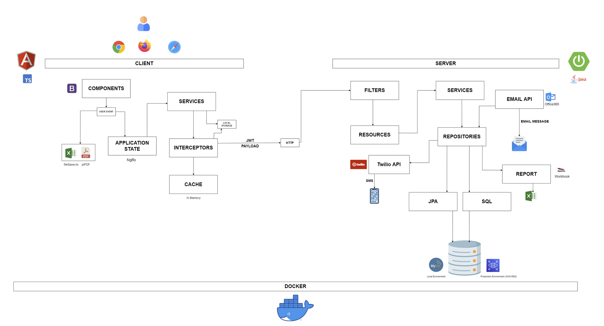

# Secure-Invoices Backend

Secure-Invoices Backend is the server-side component of the Secure-Invoices web application. It provides RESTful APIs for managing authentication, user profiles, clients, and invoices. The backend ensures secure data processing with JWT-based authentication and supports data export in multiple formats.

## Features

+ Authentication & Security: Implements JWT-based authentication and Two-Factor Authentication (2FA).

+ User Management: Handles user profiles, roles, and modification history.

+ Client & Invoice Management: CRUD operations for clients and invoices.

+ Admin Dashboard: Provides statistics and analytics for administrators.

+ Data Export: Supports exporting data in Excel and PDF formats.

## Tech Stack

+ Framework: Spring Boot (Spring Framework)

+ Database: MySQL, Spring Data JDBC, Spring Data JPA

+ Authentication: JWT, Spring Security

+ API: RESTful services

## Application Design Overview

    

### Database Schema

    

